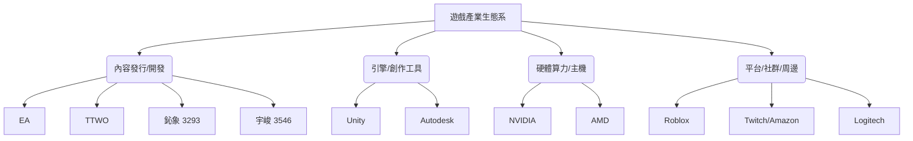

# 投資標的專題匯報：台美遊戲產業股市波動分析 (2026-06-21)

> 免責聲明：本報告是投資研究輔助，不構成保證獲利或個人化財務建議。配置比例為「新資金」假設，不等同於對既有資產的完整再平衡指令。

## 0. 本期總結

2026 年 6 月，台灣與美國的遊戲產業股市呈現顯著的「兩極分化」與「催化劑明確化」現象。

- **重大催化劑落實**：美國發行巨頭 **Take-Two (TTWO)** 正式確認遊戲史詩級大作 *Grand Theft Auto VI (GTA 6)* 將於 **2026 年 11 月 19 日** 上市，並將於 **2026 年 6 月 25 日** 開放預購。此消息消除市場對再度延期的焦慮，推升股價上揚 4-6%，為下半年遊戲板塊注入強心針。
- **高品質複利股展現韌性**：**鈊象 (3293.TW)** 5 月合併營收創歷年同期新高（21.24 億元，年增 11.96%），海外授權營收比重維持高檔（74%），南非與英國等新市場的拓展提供穩健的基本面支撐。**Electronic Arts (EA)** 公布的 FY26 財報亦創下 Net Bookings 歷史新高，並開闢 **EA Advertising** 新營收曲線，突顯體育 IP 實時服務（Live Services）的高現金流護城河。
- **法規與訴訟下行壓力**：**Roblox (RBLX)** 因年齡認證政策與俄羅斯禁令壓制用戶增長，面臨證券集體訴訟與全年指引下修的雙重打擊，股價在 Q1 財報後暴跌 18%，凸顯平台型遊戲股在監管與變現間的摩擦風險。

---

## 1. 資料範圍與前期參考

- **生成日期**：2026-06-21
- **觀察期間**：2026-05-22 至 2026-06-21
- **參考資料**：本地 `watchlist.json`、公司官網 IR、SEC 監管文件、公開財經媒體與產業活動新聞。
- **排除範圍**：完全排除 any 加密貨幣與加密貨幣相關消息。
- **專題目的**：針對台灣與美國的遊戲開發商、發行商、遊戲引擎及周邊生態進行深度掃描，並提供 20 檔關聯候選標的與配置建議。

---

## 2. 關注標的重大新聞情報與潛在風險

### 2.1 觀察池摘要

| 標的代號 | 本期狀態 | 觀察重點 | 本期動作 |
| :--- | :--- | :--- | :--- |
| **3293.TW 鈊象** | watchlist 成員 (Rating 3) | 6/22 股東常會指引、南非等新海外授權營收貢獻 | **候選衛星**：維持高信心評級，尋求合理估值分批佈局。 |
| **TTWO** | 新納入專題關注 | 6/25 GTA 6 預購數據、11/19 實際上市評價 | **候選衛星**：高成長轉折股，預購啟動為近期最大催化。 |
| **EA** | 新納入專題關注 | EA SPORTS FC 26 暑期活動表現、廣告平台變現進度 | **候選核心**：高品質複利股，現金流極為穩定。 |
| **RBLX** | 新納入專題關注 | 8/7 訴訟前進度、年齡認證政策對 DAU 增速的摩擦 | **早期觀察**：高波動早期選擇權，暫不宜重倉。 |
| **NTDOY 任天堂** | 新納入專題關注 | Switch 2 軟體生態擴充、6月 Nintendo Direct 迴響 | **早期觀察**：主機週期中後期，等待下代主機軟體爆發。 |
| **3546.TW 宇峻** | 新納入專題關注 | 暑假檔期 4 款新作上線進度、月營收年增率 | **早期觀察**：台股中小型暑期題材股，觀察新季作營收。 |

### 2.2 持有中標的

> [!NOTE]
> 目前既有投資組合中並無持有純遊戲產業標的。以下針對 watchlist 內唯一遊戲標的鈊象 (3293.TW) 及海外主要遊戲巨頭進行深入分析。

### 2.3 僅關注標的

#### 鈊象 3293.TW

**情報：5 月營收創歷史同期新高，持續推進海外授權版圖**

- **來源**：[鉅亨網：鈊象 5 月營收 21.24 億元創同期新高](https://news.cnyes.com/news/id/5592381)、[鈊象官方 IR 月度營收公告](https://www.gametower.com.tw/corp/ir/revenue.aspx)
- **事件整理**：鈊象 2026 年 5 月合併營收為 21.24 億元，年增 11.96%，連續第四個月站穩 20 億元大關；1-5 月累計營收達 105.11 億元，年增 15.43%。海外授權（特別是英國、加拿大與南非）營收占比達 74%，維持極高毛利率。公司將於 6 月 22 日召開股東常會，宣示新遊戲開發與海外布局。
- **短期觀點**：看漲。5 月營收創高及 6 月股東會的樂觀指引，加上暑假傳統旺季來臨，有利於股價在 750~850 元區間向上突破。
- **長期觀點**：看漲。海外授權模式（毛利率 >96%）是極強的護城河。南非、英國等新市場處於開拓早期，具備 3 年以上的營收複利成長潛力。
- **主要催化**：南非市場營收正式放量、新興市場（如加拿大/歐洲其他國家）牌照取得、6/22 股東會釋出新一代手遊開發進度。
- **潛在風險**：海外法規監管風險（博弈法規調整）；匯率波動（美元/當地貨幣貶值產生匯損）。
- **追蹤指標**：月度營收年增率、海外授權占比、新取得授權地區之營收貢獻。
- **本期結論**：作為高品質成長股，維持僅關注但積極尋求佈局機會。若股價拉回至 750 元以下具備極高安全邊際。

#### Take-Two Interactive TTWO

**情報：Rockstar Games 宣布 GTA 6 於 11 月 19 日上市，6 月 25 日開放預購**

- **來源**：[Rockstar Games Newswire: GTA VI Pre-Order and Release Details](https://www.rockstargames.com/newswire/article/gta-vi-pre-order-details-2026)、[TradingView TTWO Market Reaction Analysis](https://www.tradingview.com/symbols/NASDAQ-TTWO/news/)
- **事件整理**：Rockstar 官方確認 *Grand Theft Auto VI* 將於 2026 年 11 月 19 日上市，並訂於 2026 年 6 月 25 日全球同步開放預購。此消息直接帶動股價於 6 月中旬上揚約 5%。
- **短期觀點**：看漲。6 月 25 日的預購啟動是巨大的短期催化劑，若首週預購數據突破歷史紀錄，將激發市場 FOMO 情緒。
- **長期觀點**：看漲。GTA 6 是遊戲史上最龐大之單一催化劑。其後續 GTA Online 的實時服務（Live Services）預期將在未來 3~5 年為 Take-Two 帶來極高利潤的經常性收入。
- **主要催化**：6/25 預購成績單、後續官方預告片釋出、11/19 首發銷量。
- **潛在風險**：首發若出現嚴重技術 Bug（類似 *Cyberpunk 2077* 事件）將嚴重打擊股價；行銷與開發費用過高稀釋短期獲利。
- **追蹤指標**：預購量走勢、遊戲開發進度更新、分析師對首財年營收估值。
- **本期結論**：典型「成長轉折/重大事件驅動股」，適合在預購數據明朗前，分批配置作為衛星部位。

#### Electronic Arts EA

**情報：FY26 財報創 Net Bookings 歷史新高，啟動廣告平台變現**

- **來源**：[EA Q4 & FY26 Earnings Release](https://ir.ea.com/financial-information/quarterly-results/default.aspx)、[EA SPORTS FC 26 and EA Advertising Announcements](https://news.ea.com/press-releases/default.aspx)
- **事件整理**：EA 公布 2026 財年 Net Bookings 達 80.26 億美元，年增 9%，創歷史新高，主因《戰地風雲 6》強勁表現與 Live Services 穩定增長。6 月 15 日正式推出 **EA Advertising** 廣告平台，透過遊戲內數字廣告拓展全新營收來源。
- **短期觀點**：持平。財報利多已被市場消化，股價在 140~150 美元高檔盤整，後續需觀察歐國盃/美洲盃對 *EA SPORTS FC* 實時服務的消費刺激。
- **長期觀點**：看漲。EA 擁有極強的體育 IP（FC, Madden NFL）。這些年度更新的遊戲具備極高的用戶黏著度與穩定的抽卡（Ultimate Team）變現，是遊戲界的「高品質複利股」。
- **主要催化**：*EA SPORTS FC 26* 秋季上市表現、EA Advertising 平台的營收能見度。
- **潛在風險**：開箱/抽卡機制在歐洲面臨反賭博法規監管；授權費上漲。
- **追蹤指標**：Live Services 營收占比、自由現金流、廣告業務季增率。
- **本期結論**：波動率低於同業，適合追求穩定現金流與持續買回庫藏股的投資人，作核心配置。

#### Roblox RBLX

**情報：安全認證摩擦壓制用戶增速，面臨證券集體訴訟**

- **來源**：[Roblox Q1 2026 Financial Results](https://ir.roblox.com/)、[Roblox Securities Class Action Lawsuit Notice](https://www.tradingview.com/symbols/NYSE-RBLX/news/)
- **事件整理**：Roblox Q1 財報顯示 DAU 達 1.32 億（年增 35%），但環比增速放緩，主因全球年齡認證政策限制了新用戶獲取及平台間通訊，加上俄羅斯地區禁用。公司下修全年 Net Bookings 增速至 8%-12%。股價暴跌後正面臨集體訴訟（訴訟期限至 2026 年 8 月 7 日）。
- **短期觀點**：看跌。集體訴訟帶來的聲譽風險與短期政策摩擦將持續壓制估值倍數，7 月底的 Q2 財報可能仍面臨逆風。
- **長期觀點**：持平。作為全球最大的 UGC 遊戲平台，擁有龐大的青少年受眾，具備長期網路效應。但需經歷安全法規調整的陣痛期。
- **主要催化**：8/7 訴訟進展、Q2 季報中 DAU 增速是否止跌回升。
- **潛在風險**：訴訟賠償與安全聲譽受損；青少年流失至 *Fortnite Creative* 等競爭平台。
- **追蹤指標**：DAU 月增率、每活躍用戶平均消費（ABPU）、研發與行銷費用控管。
- **本期結論**：屬於高風險的「早期選擇權/轉折股」，短期不宜加碼，應等待訴訟落地與 DAU 增速回溫。

---

## 3. 接下來可關注的其他投資標的

### 3.1 跨產業雷達

遊戲產業的長期需求曲線並非單一的「遊戲內容銷售」，而是由**發行內容**、**引擎與創作工具**、**主機與硬體算力**、**社群與直播平台**等四大支柱交互推動。以下掃描 20 檔台美遊戲及關聯產業候選標的：

### 3.2 20 檔遊戲與關聯產業候選標的分類

#### 核心候選 (4 檔)

1. **Electronic Arts (EA)**
   - **投資主軸**：運動類 IP 壟斷、Live Services 高經常性收入。
   - **為何現在值得看**：FY26 財報證明防守韌性，新推廣告平台有潛在增量。
   - **3年催化**：*EA SPORTS FC* 穩健增長、廣告平台變現。
   - **主要風險**：歐洲抽卡政策監管。
   - **屬性與角色**：高品質複利股。新資金核心配置。
2. **Microsoft (MSFT)**
   - **投資主軸**：Xbox Game Pass 訂閱制、收購動視暴雪後的內容帝國。
   - **為何現在值得看**：XGP 逐漸成為遊戲界的 Netflix，雲端遊戲基礎設施領先。
   - **3年催化**：暴雪新作加入訂閱制、雲端遊戲普及。
   - **主要風險**：主機硬體銷售衰退、反壟斷調查。
   - **屬性與角色**：高品質複利股。跨產業科技/遊戲核心。
3. **Sony Group (SONY)**
   - **投資主軸**：PlayStation 5 生態系龍頭、第一方獨佔遊戲。
   - **為何現在值得看**：影像感測器與遊戲主機雙引擎，估值相對美股科技股便宜。
   - **3年催化**：PS5 Pro / PS6 研發指引、半導體部門復甦。
   - **主要風險**：硬體毛利率壓縮、第一方遊戲開發成本失控。
   - **屬性與角色**：高品質複利股。跨主機與半導體核心。
4. **VOO (S&P 500 ETF)**
   - **投資主軸**：美股大盤指數，分散單一遊戲公司的高風險。
   - **為何現在值得看**：大盤受惠 AI 科技，同時包含微軟、亞馬遜等遊戲關聯權值。
   - **3年催化**：美股盈餘持續增長。
   - **主要風險**：高利率維持、大型科技股集中度高。
   - **屬性與角色**：高品質複利股。新資金安全防禦底倉。

#### 衛星候選 (6 檔)

5. **Take-Two (TTWO)**
   - **投資主軸**：*GTA 6* 史詩級發售驅動。
   - **為何現在值得看**：6/25 啟動預購，上市日期敲定消除延期風險。
   - **3年催化**：*GTA 6* 於 2026/11/19 發售，隨後 *GTA Online* 經常性收入爆發。
   - **主要風險**：上市後出現嚴重 Bug 導致股價回檔。
   - **屬性與角色**：成長轉折股。事件驅動型衛星。
6. **鈊象 (3293.TW)**
   - **投資主軸**：海外線上博弈授權、極高毛利率（>96%）。
   - **為何現在值得看**：5月營收創新高，進軍南非與英國市場，6/22 股東會指引。
   - **3年催化**：新海外市場牌照取得與授權金入帳。
   - **主要風險**：特定市場法規變動。
   - **屬性與角色**：高品質複利股。台股高股息兼具成長之衛星。
7. **NVIDIA (NVDA)**
   - **投資主軸**：GeForce 顯示卡（遊戲硬體）、AI 算力。
   - **為何現在值得看**：遊戲 GPU 仍是 PC 玩家首選，RTX 50 系列預期帶動換機潮。
   - **3年催化**：新一代顯卡上市、AI 驅動 NPC（NVIDIA ACE）商用化。
   - **主要風險**：AI 資本支出泡沫化、出口管制。
   - **屬性與角色**：高品質複利股。硬體與 AI 衛星。
8. **AMD (AMD)**
   - **投資主軸**：PS5 與 Xbox 主機 APU 獨家供應商、Radeon 顯示卡。
   - **為何現在值得看**：隨主機週期進入後期及 PC 顯卡市佔調整，估值回檔至吸引區。
   - **3年催化**：下一代主機晶片合約落實、APU 技術領先。
   - **主要風險**：NVIDIA 在遊戲顯卡市場的絕對壟斷。
   - **屬性與角色**：成長轉折股. 半導體衛星.
9. **Logitech (LOGI)**
   - **投資主軸**：電競滑鼠、鍵盤、耳機等外設龍頭。
   - **為何現在值得看**：電競產業復甦，混合辦公與電競需求穩定。
   - **3年催化**：AI 整合外設（如專屬 AI 鍵）推動升級潮。
   - **主要風險**：平價品牌競爭、消費性電子疲軟。
   - **屬性與角色**：高品質複利股。周邊硬體衛星。
10. **Amazon (AMZN)**
    - **投資主軸**：擁有全球最大遊戲直播平台 **Twitch**、Prime Gaming 服務。
    - **為何現在值得看**：Twitch 在遊戲社群具備不可替代的黏著度，帶動 Prime 訂閱。
    - **3年催化**：廣告技術整合提升 Twitch 變現率。
    - **主要風險**：Twitch 營運成本高昂、創作者分成爭議。
    - **屬性與角色**：高品質複利股。平台社群衛星。

#### 早期觀察候選 (10 檔)

11. **Roblox (RBLX)**
    - **投資主軸**：最大 UGC 遊戲平台，青少年虛擬社交。
    - **為何現在值得看**：股價因財報指引修正與訴訟暴跌，PS 估值降至歷史低點。
    - **3年催化**：安全合規摩擦結束、廣告與虛擬電子商務變現。
    - **主要風險**：集體訴訟案進展、DAU 持續失速。
    - **屬性與角色**：早期選擇權。高風險轉折觀察。
12. **Nintendo (NTDOY)**
    - **投資主軸**：獨家 IP 帝國（瑪利歐、薩爾達）、下代 Switch 軟體銷售。
    - **為何現在值得看**：Switch 2 已推出一年，硬體基數擴大後迎來軟體爆發期。
    - **3年催化**：*Legend of Zelda* 新系列、*Mario* 新作發售。
    - **主要風險**：新主機生命週期縮短。
    - **屬性與角色**：高品質複利股。主機生態觀察。
13. **Unity Software (U)**
    - **投資主軸**：全球兩大遊戲引擎之一，手遊開發市佔 >70%。
    - **為何現在值得看**：管理層重組、廢除爭議性收費政策，股價在歷史底部。
    - **3年催化**：RT3D（即時 3D）在工業/車用推廣、Runtime Fee 政策重組效益顯現。
    - **主要風險**：開發者信任流失、虧損持續。
    - **屬性與角色**：成長轉折股。引擎軟體觀察。
14. **宇峻 (3546.TW)**
    - **投資主軸**：經典 IP（三國群英傳）、暑假新作檔期。
    - **為何現在值得看**：下半年將推出 4 款新作（包含 7月《三國群英傳：策定九州》）。
    - **3年催化**：新作在中國與海外市場（如日本、東南亞）授權成功。
    - **主要風險**：新作銷量不及預期。
    - **屬性與角色**：早期選擇權。台股中小型新品催化觀察。
15. **遊戲橘子 (6180.TW)**
    - **投資主軸**：台灣大型遊戲代理（天堂M）、轉型 AI 應用。
    - **為何現在值得看**：積極導入生成式 AI 與機器人載體，尋求傳統代理外的第二曲線。
    - **3年催化**：AI 應用商業化營收貢獻、核心代理合約續約。
    - **主要風險**：核心舊遊戲營收自然衰退。
    - **屬性與角色**：早期選擇權。轉型題材觀察。
16. **Alphabet (GOOGL)**
    - **投資主軸**：Google Play 遊戲分潤、YouTube Gaming 直播。
    - **為何現在值得看**：行動遊戲分潤為高利潤來源，YouTube Gaming 與 Twitch 競爭抗衡。
    - **3年催化**：雲端遊戲與 YouTube 互動功能深化。
    - **主要風險**：應用程式商店反壟斷監管，分潤比例被迫調降。
    - **屬性與角色**：高品質複利股。平台分潤觀察。
17. **嗶哩嗶哩 BILI**
    - **投資主軸**：中國二次元遊戲主要發行管道與社群。
    - **為何現在值得看**：獨家代理之新遊戲表現良好，社群黏著度高。
    - **3年催化**：聯運遊戲爆款出現、廣告營收損益兩平。
    - **主要風險**：中國遊戲版號與內容監管。
    - **屬性與角色**：成長轉折股。中國市場觀察。
18. **Palantir (PLTR)**
    - **投資主軸**：AIP 平台在遊戲營運與防作弊的數據分析應用。
    - **為何現在值得看**：大型遊戲商（如 EA）需利用 AI 進行即時玩家行為分析與防作弊。
    - **3年催化**：AI 數據平台在非軍工領域的企業端客戶大幅增長。
    - **主要風險**：估值極高、企業端簽約進度放緩。
    - **屬性與角色**：高品質複利股。AI 工具觀察。
19. **Autodesk (ADSK)**
    - **投資主軸**：遊戲美術與 3D 建模工具（3ds Max, Maya）。
    - **為何現在值得看**：遊戲與影視美術設計的軟體訂閱制霸主，護城河極深。
    - **3年催化**：生成式 AI 輔助 3D 建模功能整合，提高訂閱客單價。
    - **主要風險**：開源 3D 軟體（如 Blender）蠶食低階市場。
    - **屬性與角色**：高品質複利股。工具軟體觀察。
20. **Turtle Beach (HEAR)**
    - **投資主軸**：電競耳機與控制器品牌。
    - **為何現在值得看**：受惠於 *GTA 6* 等大作上市，主機配件需求預期於下半年回升。
    - **3年催化**：硬體升級週期、與熱門遊戲聯名外設。
    - **主要風險**：毛利率受供應鏈成本波動影響大。
    - **屬性與角色**：早期選擇權。硬體周邊觀察。

---

## 4. 估值、情境與催化日曆

### 4.1 核心標的估值與進場紀律

1. **鈊象 (3293.TW)**
   - **估值法**：本益比（P/E）。目前股價約 793 元，預估 2026 年 EPS 可達 43-45 元。歷史合理本益比區間為 16-22 倍。目前 P/E 約 18 倍。
   - **進場紀律**：股價在 750 元以下（P/E < 17倍）屬於**便宜/具安全邊際**；750-850 元為**合理**；>900 元**偏貴**。新資金建議在合理區間分批佈局，便宜區間加碼。
2. **Take-Two (TTWO)**
   - **估值法**：EV/EBITDA 與 反向 DCF。由於 GTA 6 的研發投入大，目前 GAAP P/E 扭曲，但若採用 2027/2028 財年（GTA 6 完整貢獻）的前瞻估值，EBITDA 將大幅跳升。
   - **進場紀律**：目前因 6/25 預購與上市日期敲定，股價已反映部分利多。155-165 美元為**合理偏便宜**（考慮到 3 年內的巨大爆發力）；>180 美元則**偏貴**，面臨上市延遲的修正風險。建議預購前小幅建倉，等待實際預購與上市數據分批推進。

### 4.2 情境分析

| 標的 | 樂觀情境 (30% 概率) | 基本情境 (50% 概率) | 悲觀情境 (20% 概率) |
| :--- | :--- | :--- | :--- |
| **鈊象 (3293.TW)** | 南非/歐洲授權表現翻倍，研發成果顯著，EPS >48 元。股價上攻 950 元。 | 海外授權穩健增長，EPS 約 44 元，股價在 780-860 元盤整。 | 海外監管政策生變，營收增長停滯，股價回測 680 元。 |
| **TTWO** | GTA 6 預購破歷史紀錄，11/19 銷量超預期，股價突破 200 美元。 | 預購符合預期，遊戲按時發售，評價優良，股價緩步升至 175-185 美元。 | 遊戲首發有重大 Bug 遭玩家差評，或再次微幅延期，股價跌回 135 美元。 |
| **EA** | 實時服務營收大增，廣告平台成長迅速，營運毛利率改善，股價 >165 美元。 | 體育遊戲穩定，經常性現金流良好，股價在 140-150 美元區間慢速墊高。 | 開箱政策遭歐洲全面禁止，Live Services 營收重創，股價跌破 120 美元。 |

### 4.3 催化日曆

| 預估時間 | 標的 | 事件類型 | 事件描述 |
| :--- | :--- | :--- | :--- |
| **2026/06/22** | 3293.TW | 股東會 | 召開股東常會，揭示新遊戲與海外市場規劃。 |
| **2026/06/25** | TTWO | 產品上線 | *GTA 6* 全球同步開啟預購。 |
| **2026/07/05** | 3293.TW / 3546.TW | 財務公告 | 公布 6 月度合併營收，檢視暑期旺季開端。 |
| **2026/07/30** | RBLX | 財務報告 | 預計公布 Q2 2026 財報，觀察 DAU 增速是否改善。 |
| **2026/08/07** | RBLX | 監管訴訟 | 證券集體訴訟尋求首席原告的最後截止日。 |
| **2026/11/19** | TTWO | 產品上線 | *GTA 6* 正式全球上市發售。 |

### 4.4 投資組合重疊度

- 遊戲發行個股（如 TTWO, EA）與大盤指數（VOO）的個股重疊度極低（權重均 <0.2%），能有效提供與大盤不同的 **Alpha 收益**。
- 鈊象 (3293.TW) 與台股大盤 (0050.TW) 的重疊度亦不高，且其商業模式為純軟體授權，相較於高度依賴硬體半導體週期的台灣電子供應鏈，具備優異的**跨週期防守性**。

---

## 5. 100% 新資金配置建議

若目前有 100% 新資金，且投資策略定位於「捕捉台美遊戲產業長期成長與大作催化，同時維持下檔防護」，建議配置如下：

| 標的代號 | 角色 | 建議配置比例 | 市場/貨幣 | 信心指數 | 主要理由 | 主要風險 |
| :--- | :--- | :--- | :--- | :--- | :--- | :--- |
| **VOO** | 市場核心底倉 | 30.0% | 美股 / USD | ★★★★★ | 提供基本大盤防禦力，降低單一遊戲產業的高波動風險。 | 總體經濟與利率風險。 |
| **EA** | 產業核心（高品質複利） | 15.0% | 美股 / USD | ★★★★☆ | 運動 IP 壟斷，Live Services 提供極強且穩定的自由現金流。 | 開箱政策監管趨嚴。 |
| **鈊象 (3293.TW)** | 產業衛星（高品質複利） | 15.0% | 台股 / TWD | ★★★★☆ | 海外授權高毛利模式，新市場（南非/英國）成長動能強。 | 特定法規與匯率風險。 |
| **TTWO** | 產業衛星（成長轉折） | 15.0% | 美股 / USD | ★★★★☆ | *GTA 6* 確定 11/19 上市、6/25 預購，為近三年最強催化劑。 | 遊戲首發 Bug 或延期。 |
| **NVDA** | 關聯衛星（硬體與 AI） | 15.0% | 美股 / USD | ★★★★☆ | 遊戲顯卡絕對霸主，且受惠 AI 算力基礎設施長期需求。 | 估值偏高與 capex 放緩。 |
| **CASH_TWD / USD** | 保留現金 | 10.0% | - | - | 保留加碼空間，等待 RBLX 或 Unity 出現明確轉折點。 | 通膨侵蝕購買力。 |

> [!TIP]
> 此配置中，純遊戲內容發行與開發（EA, 鈊象, TTWO）合計占比為 45%，硬體與大盤（NVDA, VOO）占 45%，現金 10%。整體產業曝險未超過 45% 的硬性上限，具備優良的風險分散性。

---

## 6. 目前持股賣出/減碼建議

- **3293.TW 鈊象**（Rating 3, 未持有）：**維持加碼觀察**。公司基本面極佳，5月營收創新高。由於並未實質持有，不需執行賣出或減碼。後續若股價受大盤拖累拉回至 750 元以下，可視為中長期佈局契機。
- **既有 watchlist 內非遊戲標的**（如 QQQ, TSLA, 2330.TW 等）：本期為遊戲產業專題匯報，不對其他板塊執行主動買賣指令，建議維持前期（2026-06-21 綜合報告）之持股狀態。

---

## 7. 投資組合曝險與重疊度

- **單一主題曝險**：遊戲內容板塊（TTWO + EA + 鈊象）總曝險控制在 45%，搭配 30% 核心 ETF (VOO) 與 15% 半導體/AI 硬體 (NVDA)，確保不會因單一遊戲作品的成敗對整體組合產生系統性毀滅。
- **外匯曝險**：美股資產占比 75% (以 USD 計價)，台股資產與現金占 25% (以 TWD 計價)。需注意 USD/TWD 匯率波動對總資產淨值的影響。

---

## 8. 本期追蹤清單

1. **2026-06-22 (明天)**：追蹤鈊象 (3293.TW) 股東常會後之官方聲明與法人報告。
2. **2026-06-25**：密切注意 Take-Two (TTWO) *GTA 6* 開放預購後，Rockstar 官方或市場分析機構釋出的首日/首週預購數據。
3. **2026-07-05 左右**：檢視台灣遊戲股（鈊象、宇峻）6 月份合併營收，評估暑期旺季開端效應。

---

## 9. 本期資料限制

- **資料限制**：本報告未採用任何付費之遊戲產業調研報告（如 Newzoo 或 Niko Partners 的付費資料庫），亦未讀取雲端 Supabase 即時使用者庫存數據。
- **資訊覆蓋**：本期報告僅涵蓋台美主流公開市場個股，未納入未上市之遊戲工作室或日本/歐洲當地掛牌之遊戲股（除任天堂 ADR 外）。
